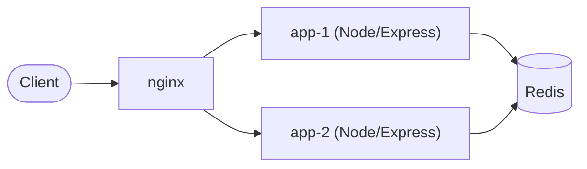

# ScaleLink

A URL shortener whose point is the part underneath: an **atomic Redis-Lua
sliding-window rate limiter** and **race-free short-code allocation**, shared
by multiple stateless Node/Express instances behind nginx, with the concurrency
claims proven by tests against a real Redis.

## Why it is technically interesting

* **One rate limit across instances.** The limiter is a single Lua script on
  Redis: trim, count, decide and record cannot interleave, so N app instances
  enforce one shared budget. It judges time by *Redis's* clock, because an
  earlier version that used each app's `Date.now()` admitted 2× the limit when
  two instances' clocks differed by one window.
* **Short codes are reserved with one `SET key url NX` command.** No
  check-then-set gap: two requests cannot get the same code, a live link cannot
  be overwritten, and retries are bounded. The previous `EXISTS`-then-`SET` was
  reproduced handing the same code to 30 concurrent users while keeping only one URL.
* **Failure behavior is a decision, not an accident.** Redis down or stalled →
  fast `503`, the limiter fails closed, a write whose reply was lost is never
  silently re-sent, and the instance reconnects by itself.
* **Client identity can't be forged.** `trust proxy` defaults to *nobody*;
  `X-Forwarded-For` is only honoured from configured hops.
* **The tests are adversarial.** 98 tests, all against a real Redis (no mock),
  including two real OS processes racing, real key collisions, and TCP-level
  fault injection. 16 deliberate bugs were injected into the source one at a
  time; every one made a test fail ([TESTING.md](TESTING.md)).

## Architecture



Apps are stateless; all shared state (links, click counts, limiter state) is in
Redis. Full design, sequence diagrams, key layout and reasoning:
**[docs/ARCHITECTURE.md](docs/ARCHITECTURE.md)**.

## Core guarantees (and what proves each)

| Guarantee | Proof |
| --- | --- |
| Exactly `limit` of 200 concurrent requests admitted, from 8 independent connections | `tests/limiter.test.js` |
| The same holds across two real app processes | `tests/multiInstance.test.js` |
| Exactly one of 30 concurrent creators wins a contested code; nothing is overwritten | `tests/links.test.js` |
| Real collisions across two processes never issue a code twice (`CODE_LENGTH=1`) | `tests/multiInstance.test.js` |
| 200 concurrent redirects are counted as exactly 200 clicks | `tests/links.test.js` |
| A forged `X-Forwarded-For` does not widen the limit | `tests/trustProxy.test.js` |
| Redis failure → bounded `503`, no blind write retry, self-recovery | `tests/failure.test.js` |

## Rate limiter

Sliding-window **log**: a sorted set of accepted-request timestamps per client;
admit if fewer than `limit` fall in `(now − window, now]`. Any interval of
length `window` therefore holds at most `limit` admitted requests (no
fixed-window boundary burst). Rejected requests record nothing, so the set never
exceeds `limit` members, and `PEXPIRE` removes an idle client's key. `Retry-After`
is computed from the oldest live entry. Cost: O(log N + M) per request, memory
O(`limit`) per active client. Details and trade-offs:
[ARCHITECTURE.md](docs/ARCHITECTURE.md#rate-limiter).

## URL-shortening consistency model

The only write that creates a link is `SET link:{code} url NX [EX ttl]` — a
single Redis command, hence the atomicity boundary. A collision (`nil`) retries
with another random code, at most 5 times, then answers `503` without writing.
Resolve-and-count is one Lua step, so a missing or expired link never gets an
orphan click counter. Consistency is that of one Redis instance; there is no
replica or failover. [Details](docs/ARCHITECTURE.md#link-creation-and-the-consistency-model).

## Failure behavior

| Situation | Behavior |
| --- | --- |
| Redis down or stalled | `503` + `Retry-After` within the command timeout (default 1 s); redirects return `503`, never a false `404` |
| Rate limiter backend error | fails **closed** (`503`) |
| Connection lost mid-write | `503`; the write is **not** re-sent |
| Liveness / readiness | `/health` stays `200`; `/ready` is `503` while Redis is unreachable |

Redis itself is a single point of failure here. Rationale and trade-offs:
[ARCHITECTURE.md](docs/ARCHITECTURE.md#failure-semantics).

## Tech stack

Node.js 20+, Express 5, Redis 7 (ioredis, Lua), nginx, Docker Compose, Jest +
supertest, k6, GitHub Actions.

## Testing

```bash
docker run -d -p 6379:6379 redis:7-alpine   # a real Redis is REQUIRED; tests fail (not skip) without one
npm ci
npm test                                     # 98 tests: unit + real-Redis integration/concurrency
```

The suite uses Redis database 15 (`TEST_REDIS_URL` to change; it refuses db 0
because it flushes). CI runs it on Node 20 and 22 against a Redis service
container, then builds the real Docker image and smoke-tests the full nginx +
2-instance topology. See [TESTING.md](TESTING.md).

## Benchmark

<!--BENCH-->

## Quick start

```bash
docker compose up --build --wait            # nginx :8080 -> app-1, app-2 -> redis
curl -s -X POST localhost:8080/api/shorten -H 'content-type: application/json' \
     -d '{"url":"https://example.com/some/long/path"}'
# {"code":"aB3_xYz","shortUrl":"http://localhost:8080/aB3_xYz", ...}
curl -i localhost:8080/aB3_xYz              # 302 -> the original URL
curl -s localhost:8080/aB3_xYz/stats        # {"clicks":1, ...}
node scripts/smoke.js http://localhost:8080 # end-to-end checks
docker compose down -v
```

Without Docker: run a Redis, then `npm ci && npm start` (see [.env.example](.env.example)).

## API

| Method & path | Success | Errors |
| --- | --- | --- |
| `POST /api/shorten` `{"url": "...", "ttlSeconds"?: int}` | `201 {code, shortUrl, originalUrl, ttlSeconds, servedBy}` | `400` invalid body/URL, `413` body > 4 KB, `415` not JSON, `429` over limit (`Retry-After`), `503` Redis unavailable or no free code |
| `GET /:code` | `302 Location: <url>` (counts a click; `HEAD` does not) | `404` unknown/expired, `503` |
| `GET /:code/stats` | `200 {code, originalUrl, clicks, servedBy}` | `404`, `503` |
| `GET /health` | `200` liveness | |
| `GET /ready` | `200` when Redis answers | `503` |

URLs must be absolute `http(s)`, at most 2048 characters, without embedded
credentials; unknown body fields are rejected. `ttlSeconds` is 1 to 31 536 000.
Responses to `POST /api/shorten` carry `X-RateLimit-Limit`,
`X-RateLimit-Remaining`, `X-Served-By`, and `Retry-After` on `429`.

## Limitations

* **Redis is a single point of failure** (no replica, sentinel or cluster); AOF is
  configured in compose but crash recovery was not tested.
* Rate-limit identity is the client IP: NAT users share a budget and an IPv6
  client can rotate within its /64. Only `POST /api/shorten` is limited;
  redirects are not.
* No authentication, no link deletion/update, no per-user ownership,
  `GET /:code/stats` is public.
* Click counts count every successful `GET` (bots included), not unique visitors.
* The exact-millisecond window boundary is not asserted by a test (Redis's clock
  cannot be controlled); window behavior is tested with seeded state and
  explicit real-time tolerances.
* Redis Cluster compatibility is by key design (hash tags); cluster mode was
  never run.
* The benchmark below is one environment, single machine, load generator
  co-located with the system under test.
* `terraform/` is unverified reference code ([docs/DEPLOYMENT.md](docs/DEPLOYMENT.md)).

## Repository map

```
src/
  app.js                            app factory (explicit dependencies)
  server.js                         entrypoint, graceful shutdown
  config/env.js                     strict env parsing, TRUST_PROXY rules
  config/redis.js                   ioredis client + failure policy
  limiter/slidingWindowLimiter.js   the Lua script + its rationale
  middleware/distributedRateLimiter.js   limiter -> HTTP (headers, 429, fail closed)
  middleware/errorHandler.js
  links/linkStore.js                SET NX reservation, resolve+count script
  links/validate.js                 request validation
  controllers/, routes/             HTTP wiring
tests/                              unit/, helpers/ (fault proxy, process spawner), real-Redis suites
scripts/                            smoke.js, bench.sh, mutation-check.py
loadtest/k6-script.js               open-model load test
nginx/nginx.conf                    one-hop proxy config
docker-compose.yml  Dockerfile      the reference topology
docs/                               ARCHITECTURE.md, DEPLOYMENT.md
BENCHMARK.md  TESTING.md  INTERVIEW_NOTES.md  RESUME_BULLETS.md
terraform/                          unverified Azure reference
```
