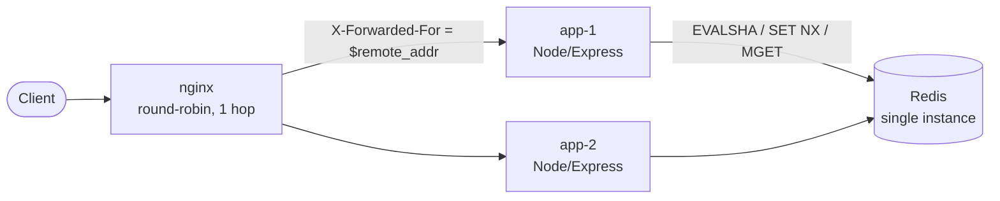
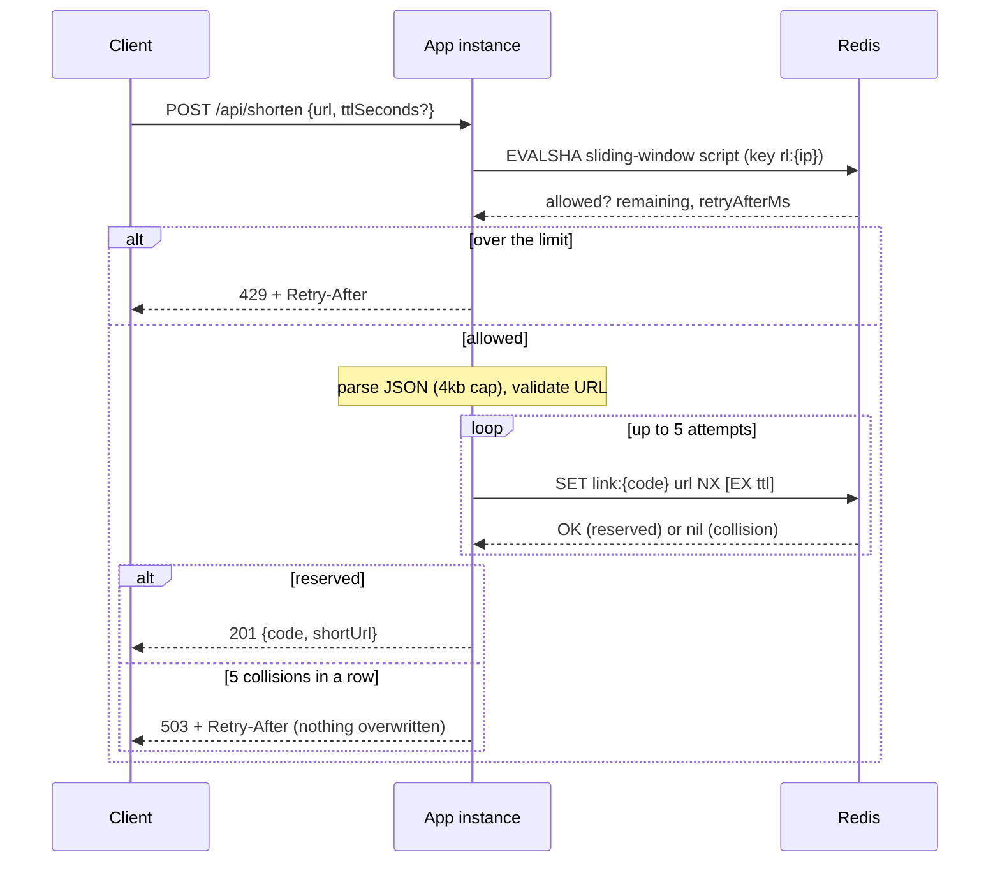

# ScaleLink architecture

This document explains *why* the system is built the way it is: where the
atomicity boundaries are, what Redis is authoritative for, and what happens
when things fail. Every guarantee below is tied to the test that exercises it
(see [Verification map](#verification-map)). Where something is **not**
guaranteed or **not** verified, it says so.

## Topology



* The app instances are **stateless**. Everything that must be shared (links,
  click counts, rate-limit state) lives in Redis, so any instance can serve any
  request and instances can be added or removed freely.
* Redis is the single point of coordination, and also a single point of failure
  (see [Failure semantics](#failure-semantics)).
* nginx is the only published entry point. App containers are not reachable
  from the host, because they trust the one hop in front of them for client
  identity (see [Client identity](#client-identity-and-trust-proxy)).

## Request paths

### `POST /api/shorten`



The limiter runs **before** the body parser, so every attempt is metered,
including malformed, oversized or otherwise invalid ones.

### `GET /:code`

```mermaid
sequenceDiagram
    participant C as Client
    participant App as App instance
    participant R as Redis

    C->>App: GET /abc1234
    App->>R: EVALSHA resolve-and-count (link:{abc1234}, link:{abc1234}:clicks)
    Note over R: GET url; if missing return nil;<br/>else INCR clicks, copy the link's TTL
    R-->>App: url or nil
    alt found
        App-->>C: 302 Location: url (Cache-Control: no-store)
    else missing or expired
        App-->>C: 404
    end
```

`HEAD` resolves the link but is not counted as a click. Codes that cannot
exist (wrong characters, over 32 chars) get a 404 without touching Redis.

## Redis keys

| Key | Type | Written by | Meaning |
| --- | --- | --- | --- |
| `link:{<code>}` | string | `SET … NX [EX]` | original URL; optional TTL |
| `link:{<code>}:clicks` | string (int) | resolve script | click count; inherits the link's remaining TTL |
| `rl:{<client ip>}` | sorted set | limiter script | accepted-request timestamps (ms), one member per accepted request; TTL = window |

The `{…}` are Redis Cluster hash tags: the two keys of one link share a slot,
which the two-key resolve script needs. **This repository runs and tests a
single Redis instance only**; the key design is cluster-compatible but cluster
mode has not been exercised.

## Rate limiter

### Algorithm: sliding-window log

For each client, keep the timestamps of its **accepted** requests in a sorted
set. A request is admitted if fewer than `limit` accepted timestamps fall in
`(now − window, now]`. Unlike a fixed-window counter this has no boundary burst
(a client cannot use `limit` at the end of one window and `limit` at the start of
the next); the hard invariant is: **any interval of length `window` contains at
most `limit` admitted requests.**

All of it is one Lua script (`src/limiter/slidingWindowLimiter.js`):

1. `now` ← Redis `TIME` (ms)
2. `ZREMRANGEBYSCORE key -inf now−window` (drop aged-out entries)
3. `count` ← `ZCARD key`
4. if `count >= limit`: **reject**, record nothing, return the time until the
   oldest entry ages out (this becomes `Retry-After`)
5. else `ZADD key now <unique member>`, `PEXPIRE key window`, **accept**

### Why Lua (and what race it removes)

The naive version is "read the count, then write": instance A reads 9 of 10,
instance B reads 9 of 10, both write, 11 requests are admitted. That is a
check-then-act race and it needs *no* unusual timing, just two requests in
flight. Redis executes a script to completion before running any other
command, so trim, count, decide and record cannot interleave with another
request for the same key, from any instance or connection. `MULTI/EXEC`
cannot express this: the decision depends on a value read inside the
transaction. `WATCH`-based optimistic retry works but turns contention into
retries; one script call is one round trip.

### Why Redis `TIME`, not the app's clock

The first version passed `Date.now()` from each app instance into the script.
Two instances whose clocks differ by one window then disagree about which
entries are expired: each treats the other's entries as aged out, and together
they admit up to **twice** the limit. This was reproduced against that version
(10 admitted at the correct clock, then 10 more admitted at an instance whose
clock was 11 s fast, with `limit=10, window=10s`). With `TIME`, every instance is
judged by the one clock that owns the data. The requirement is Redis ≥ 5
(effects replication allows `TIME` before a write inside a script); CI and
compose use `redis:7`.

Remaining clock assumption: Redis's wall clock. If it is stepped backwards
(NTP), existing entries look "in the future" and live slightly longer, which is
the *safe* direction (stricter). A forward step ages entries out early
(more permissive for a moment). Across a replica failover, the new primary's
clock applies. None of this is tested; it is stated so it is not a surprise.

### Why the member is `<ms>-<k>` and not random

Sorted-set members must be unique, or `ZADD` overwrites an existing member and
the request is silently not counted (under-counting → over-admission). The
first version used `math.random()`. That worked here (verified: distinct across
calls on Redis 7.0), but it depends on the PRNG behaviour of the Redis version.
The current member is `<now>-<ZCOUNT(now, now)>`: entries stamped with the
current millisecond are never trimmed (the trim only removes scores
`<= now − window`, and `window >= 1 ms`), so counting them gives the next
unused suffix, deterministically, with no randomness and no second key. Test:
1000 concurrent requests, many in the same millisecond, `ZCARD` must equal 1000.

### Cleanup, memory, complexity

* Rejected requests record nothing, so a client hammering a closed window cannot
  grow its own set: it never exceeds `limit` members.
* `PEXPIRE key window` on every accept: an idle client's key disappears
  `window` after its last accepted request, exactly when its newest entry would
  have aged out.
* Memory ≈ (clients active in the last window) × (≤ `limit` members each).
  A log is exact but costs O(`limit`) per client, versus O(1) for a counter.
* Time per request: O(log N + M) with N ≤ `limit` and M the number of entries
  removed (each entry is removed once).

### What it does not do

* Only `POST /api/shorten` is limited. Redirects are deliberately not (hot read
  path); an abusive reader is not throttled by the app.
* Identity is the client IP. Clients behind one NAT share a budget; an IPv6
  client with a /64 can rotate addresses within it (no prefix normalisation).
* The exact millisecond boundary of the window (is an entry stamped exactly
  `now − window` in or out?) is not asserted by a test, because Redis's clock
  cannot be controlled from a test. Window membership is tested with state
  seeded well inside/outside the window, and real expiry with explicit
  tolerances.

## Link creation and the consistency model

### The atomicity boundary is one command

```
SET link:{code} <url> NX [EX <ttl>]
```

This is the *only* write that creates a link and it is a single Redis command.
It either creates the key with its value and TTL, or does nothing and reports
that the key exists. Therefore:

* **no two requests can be given the same code** (one `NX` wins),
* **no live link can be overwritten**, and no exhausted retry loop can write
  anything,
* **no reader can observe a reserved-but-empty mapping**: the code never exists
  without its URL,
* the TTL is set in the same command, so there is no window where a link exists
  but is un-expirable.

The previous implementation did `EXISTS` then an unconditional `SET` (a
check-then-set race), and on retry exhaustion still wrote. Reproduced against
it with a generator forced to repeat one code: 30 concurrent creators were all
told `201` for the same code while only the last URL survived, and an existing
link plus its click counter were overwritten and reset.

### Collisions

A collision is just `SET … NX` returning `nil`: pick another random code and
retry, at most 5 attempts. Codes are 7 characters from a 64-symbol alphabet
(64⁷ ≈ 4.4·10¹²), so a collision is rare; the loop is bounded so a saturated
keyspace degrades to a clear `503` (+`Retry-After`) rather than spinning or
overwriting. `CODE_LENGTH` is configurable; the tests set it to 1 (64 codes) to
force *real* collisions across two OS processes without any mocking.

### Failed writes are not retried

If a `SET NX` fails with a connection error or timeout, its outcome is unknown.
The app does **not** retry it (and the Redis client is configured not to
re-send in-flight commands after a reconnect): a replay would mint a second
mapping for one request. The caller gets `503` and decides. Worst case is one
unreferenced, harmless mapping.

### Resolve + count is one step

`GET` then a separate fire-and-forget `INCR` (the previous design) could record
a click for a link that had just expired, leaving an orphan counter with no
TTL, and the counter was initialised by a second `SET` that could reset
concurrent increments. Now one script does `GET url`, returns `nil` if absent,
otherwise `INCR clicks` and copies the link's remaining TTL onto the counter.
A missing link never grows an orphan counter; the counter expires with its
link. The click is counted when the lookup succeeds, **before** the response is
delivered, so a client that disconnects mid-redirect is still counted.
`302` (not `301`) and `Cache-Control: no-store` stop caches from hiding repeat
visits.

### Consistency, precisely

Redis is the authority for all state and executes commands on one instance
serially, so single-key operations and the two scripts are linearizable *for
that instance*. This is **not** a replicated or multi-region design: with a
replica and async replication, an acknowledged write can be lost on failover,
and reads from a replica can be stale. The compose file enables AOF with
`everysec` fsync (a crash can lose about a second of acknowledged writes); that
is configuration, not something this project has crash-tested.

## Client identity and trust proxy

The limiter's identity is `req.ip`, which is whatever Express's `trust proxy`
setting says it is. The previous setting, `trust proxy: true`, trusts every hop,
so any client could send `X-Forwarded-For: <anything>` and get a fresh bucket
per request (reproduced: 50 of 50 requests admitted at `limit=5`). The shipped
k6 script exploited exactly this to simulate "many clients".

Now `TRUST_PROXY` defaults to **trust nobody** (`req.ip` = TCP peer).

| `TRUST_PROXY` | Meaning |
| --- | --- |
| unset / `false` / `0` | forwarded headers ignored |
| `1`, `2`, … | trust that many hops; `req.ip` = what the nearest trusted proxy saw |
| `loopback,10.0.0.0/8` | trust these proxies (IP, CIDR, `loopback`, `linklocal`, `uniquelocal`) |
| `true` | **refused at startup** (it re-opens the bypass) |

In compose, nginx *overwrites* `X-Forwarded-For` with `$remote_addr` and the
apps run with `TRUST_PROXY=1`; either half alone would also hold (hop-count
mode takes the rightmost entry; overwriting removes the chain), and the tests
cover forged left-hand entries in both modes.

**Deployment assumption:** with a trust setting enabled, app instances must only
be reachable via the proxy. A client that reaches an app directly can claim any
IP. Compose does not publish the app ports for this reason.

## Failure semantics

Redis is the only datastore, so "Redis unavailable" is the failure mode that
matters. The policy is deliberately uniform: **fail fast with 503, never guess.**

| Operation | Redis down / stalled | Rationale |
| --- | --- | --- |
| rate limiter | **fail closed**: `503` + `Retry-After: 1` | The protected handler needs the same Redis, so failing open would not keep the endpoint working; it would only remove protection at the moment Redis returns, and a limiter that disables itself on error hides bugs. |
| create | `503`; **not retried** | Outcome unknown after a timeout; replay could duplicate. |
| redirect / stats | `503`, **never 404** | We cannot say a link does not exist. |
| click count | part of the redirect step | No separate best-effort counter that can silently drop. |
| `/health` (liveness) | stays `200` | Process is fine; restarting app containers during a Redis outage would not help. |
| `/ready` (readiness) | `503` | Used for compose ordering and load-balancer checks. |

How it is enforced (`src/config/redis.js`): every command has a timeout (default
1000 ms), the offline queue is disabled (a down Redis rejects immediately instead
of piling up requests), and in-flight commands are not auto-resent after a
reconnect. The client reconnects on its own with capped backoff.

Trade-off accepted: a very short Redis blip surfaces as a few `503`s instead of
being masked by queueing. Clients are expected to retry on `503` using
`Retry-After`.

There is **no** replica, sentinel or cluster: Redis is a single point of failure.

## Verification map

Run `npm test` (needs a real Redis; it fails, not skips, without one).

| Guarantee | Test |
| --- | --- |
| exactly `limit` of 200 concurrent requests admitted, over 8 independent connections | `tests/limiter.test.js` |
| exactly `limit` admitted across two real OS processes | `tests/multiInstance.test.js` |
| unique member for same-millisecond requests (1000 concurrent) | `tests/limiter.test.js` |
| window membership & cleanup, seeded from Redis `TIME` | `tests/limiter.test.js` |
| a skewed app clock cannot widen the window | `tests/limiter.test.js` |
| exactly one winner among 30 creators of one code; no overwrite | `tests/links.test.js` |
| real collisions across two processes (`CODE_LENGTH=1`) | `tests/multiInstance.test.js` |
| 200 concurrent redirects → exactly 200 clicks | `tests/links.test.js` |
| no orphan counter; counter expires with its link | `tests/links.test.js` |
| forged `X-Forwarded-For` does not widen the limit (default and hop-count) | `tests/trustProxy.test.js`, `tests/multiInstance.test.js` |
| Redis down / stalled → fast 503, readiness vs liveness, self-recovery | `tests/failure.test.js` |
| a write whose reply was lost is not re-sent | `tests/failure.test.js` |
| input validation and status codes | `tests/http.test.js`, `tests/unit/*` |
| the topology end to end (nginx + 2 containers) | `scripts/smoke.js`, CI `compose-smoke` job |

The tests were also checked adversarially: 16 deliberate source mutations (for
example removing `NX`, making the limiter decision non-atomic, trusting
forwarded headers) were applied one at a time and every one made at least one
test fail. See [`TESTING.md`](../TESTING.md).
